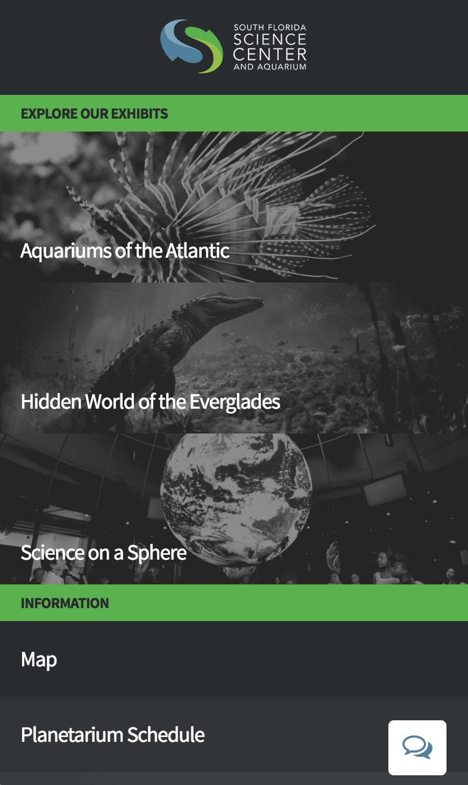
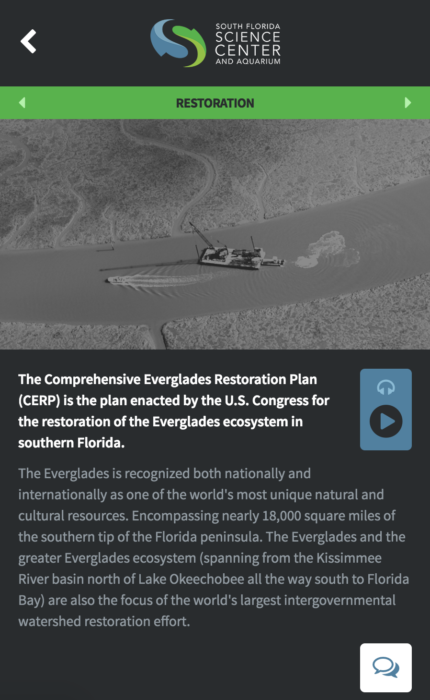
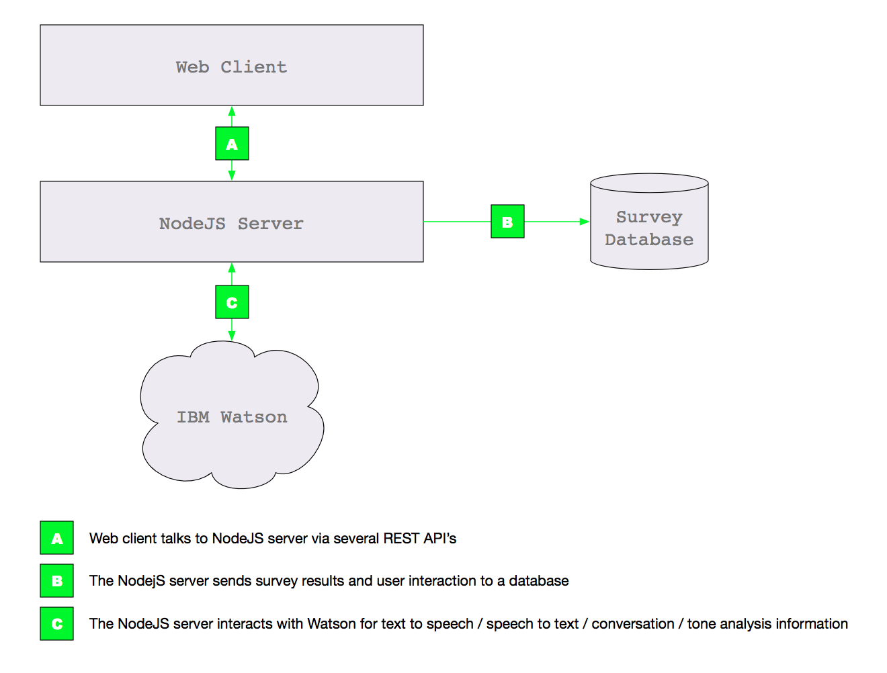
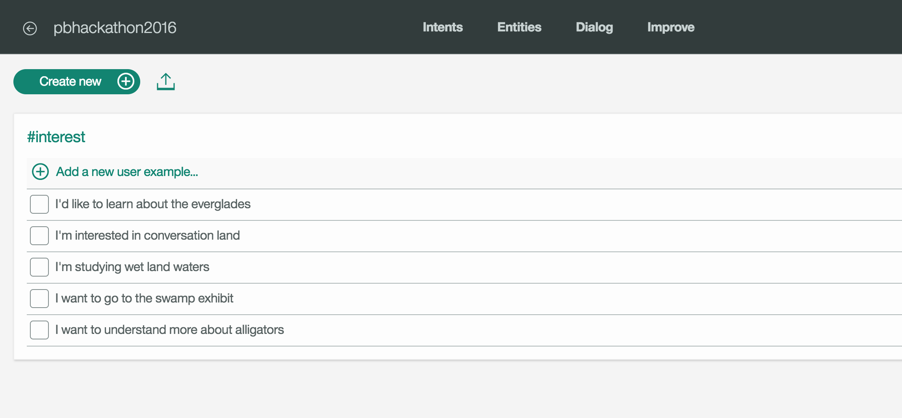
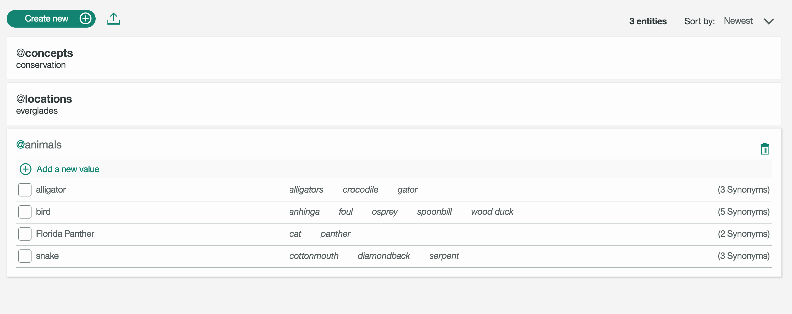
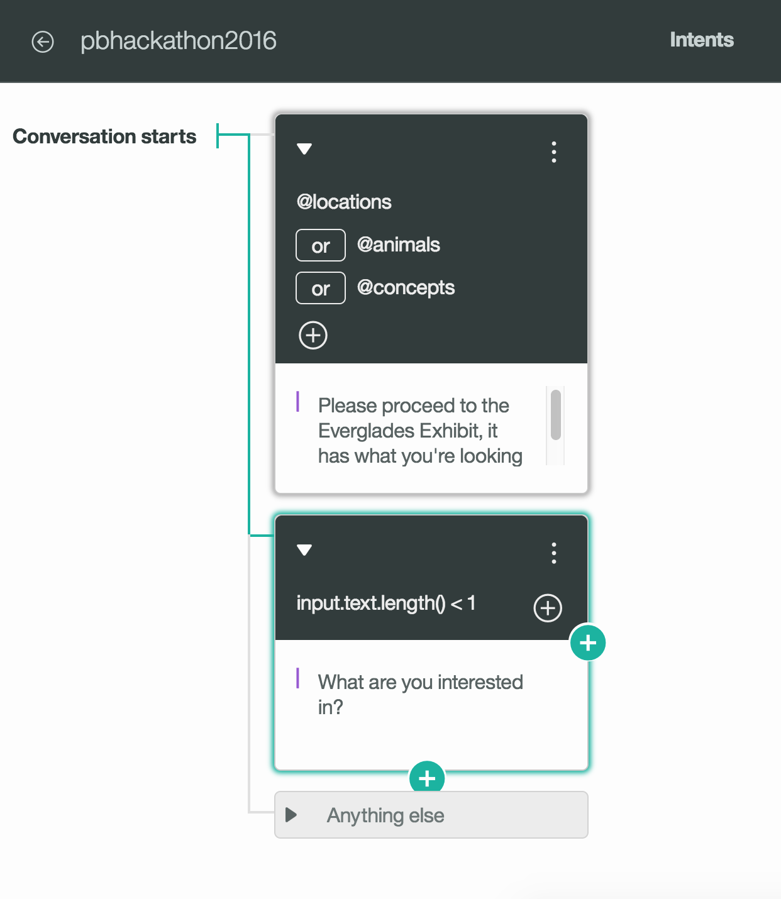

# Palm Beach Hackathon 2016 Entry

#### Guided Tour & Survey

 

## About
This project is for an entry in the 2016 Palm Beach Hackathon - http://hackathon.palmbeachtech.org/

The goal for this entry is to creatively solve the River Center's (http://lrdrivercenter.org/) and the
Science Center's (https://www.sfsciencecenter.org/) need to have interactive, interesting exhibits while
getting feedback from visitors.

This app walks visitors through a guided tour of exhibits, using artificial intelligence (IBM Watson), to best
choose which exhibits match visitors' interests.  Visitors are able to talk to a virtual guide and
be directed to their interest, audibly.  The virtual guide can also ask the visitor questions while
at an exhibit, thus getting valuable feedback.  The virtual guide will store the feedback along with a tone analysis of the visitor to determine if they were confused, happy, intrigued, angry, while at the exhibit.

## Technical
The app makes use of the following technologies:

-  IBM Watson for AI
	- Conversation AI
	- Tone Analyzer AI
	- Text to Speech AI
	- Speech to Text AI
- NodeJS for hosting the web app as well as serving up API's
- API Connect's Loopback framework for creating API's in Node
- A simple in-memory, flat file database to store survey results
- Web app (HTML/CSS/JS)

#### Architecture

## To run this on your own
You'll need NodeJS and NPM installed.  You'll also need an IBM Bluemix account to use Watson (it's free).

1.  `git clone` or download this repo
2.  `npm install`
3.  Create a `credentials.js` file in the root of the project and supply the appropriate keys (there is a sample `credentials.sample.js` you can rename and use).
4.  `node .`
5.  Visit `localhost:3000/` for the website.  Visit `localhost:3000/explorer` for the API docs

You'll also need to train Watson on how he can help your users.  Here are some screenshots of examples
of the setup for this entry.  You can also use the `sample-watson-conversation-workspace.json` file to import
settings in to your Watson Conversation workspace (should get you up and running quickly).  Note that this workspace
 will have data for things in the everglades: animals, concepts, etc. of the everglades.

## License

Open Source, Apache 2.0 license.  Please see LICENSE.md
